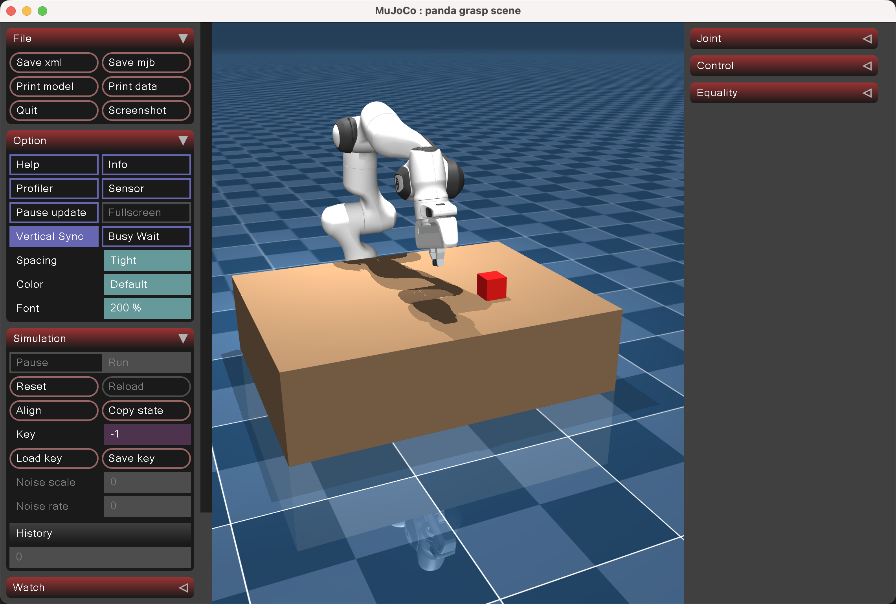

# Project Detail

This document provides a focused overview of the current repository. It is organized by folder and only covers the important parts of the project: what each part is for, what has been completed there, and how the project is currently run.

## Demo



## Current Project Scope

At the moment, the project is a local robotic learning environment prototype built around a Franka Panda grasping task. It already includes:

- a MuJoCo manipulation scene
- a reusable environment wrapper
- local runnable scripts
- project documentation and attribution records

It does not yet include a full reinforcement learning training pipeline.

## Repository Structure

### Root Directory

The project root contains the high-level project entry files and documentation.

Important files:

- `README.md`
  - introduces the project at a research level
  - explains motivation, themes, and future direction
- `THIRD_PARTY_NOTICES.md`
  - records attribution and provenance for imported third-party assets
- `panda_grasp_demo.py`
  - the simplest demo entry point
  - runs the scripted Panda grasping visualization

Completed work in this layer:

- project introduction has been written
- attribution has been documented
- a direct demo entry has been kept for quick local testing

### `docs/`

This folder contains the main project documents beyond the README.

Important files:

- `design.md`
  - explains the conceptual design direction of the project
  - describes the intended layered architecture
- `update.md`
  - records the current stage of development
  - summarizes what has already been built and what comes next
- `project_detail.md`
  - this document

### `mujoco_menagerie/`

This folder contains the MuJoCo assets and scene definitions used by the project. It includes the imported Franka Panda model and the local grasping scene built on top of it.

Important part:

- `franka_emika_panda/`
  - contains the Panda robot model, scene XML files, and mesh assets
  - includes the local `grasp_scene.xml` used by this project

Completed work in this layer:

- Franka Panda assets have been integrated locally
- a table-top cube grasping scene has been created
- the current grasping task geometry has been tuned for local experimentation

### `panda_cube_grasp/`

This folder is the main Python package for the environment itself.

Important part:

- `envs/panda_cube_grasp_env.py`
  - defines the core environment class
  - loads the scene
  - defines observation and action handling
  - implements reset, step, reward, and success logic

Completed work in this layer:

- the task has been wrapped as a reusable `Gymnasium`-style environment
- environment logic has been separated from ad hoc demo code
- the package has been structured for future RL integration

This is currently the most important code folder in the repository.

### `scripts/`

This folder contains local execution scripts.

Important file:

- `run_env.py`
  - runs the environment locally
  - supports scripted execution and random stepping
  - supports headless checking

Completed work in this layer:

- a reusable local runner has been created
- the environment can now be exercised without modifying core code

## What Has Been Completed

Across the repository, the following work has already been completed:

- a Franka Panda manipulation scene has been set up in MuJoCo
- a cube grasping task has been defined
- the project has been reorganized into a cleaner package structure
- a reusable environment wrapper has been created
- a direct visualization demo is available
- project-level documentation has been added
- attribution and license context have been documented

## How to Run the Project

All commands below assume:

```bash
cd /Users/yuzhang/Desktop/Open_Source_Contribution/Hierarchical_Reinforcement_Learning_on_Robotic_Arm
```

Run the simple demo:

```bash
python panda_grasp_demo.py
```

Run the general local environment runner:

```bash
python scripts/run_env.py
```

Run a short headless check:

```bash
python scripts/run_env.py --headless --steps 20
```

Use the environment directly in Python:

```python
from panda_cube_grasp import PandaCubeGraspEnv

env = PandaCubeGraspEnv(render_mode="human")
obs, info = env.reset()
```
